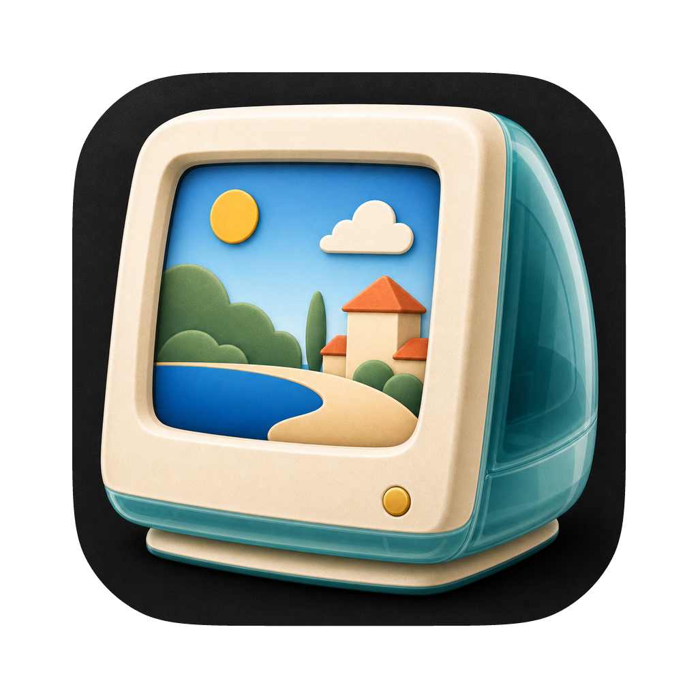

<p align="center">
  
</p>

<h1 align="center">Veduta</h1>

A local-first, open-source macOS wallpaper app for public-domain and museum artwork.

The name comes from *veduta* — the 18th-century genre of highly detailed view paintings. The idea is the same: a faithful, full-resolution picture on your desktop, refreshed whenever you like.

Veduta is inspired by [ArtPaper](https://gikken.co/artpaper/) by Gikken — it grew out of wanting that experience as an open-source, local-first app.

Right now Veduta is two things: a local data pipeline that builds an artwork library on your machine, and a minimal menu-bar app that rotates wallpapers from it. Hosting and sync come later.

## Install

The menu-bar app ships as a signed + notarized DMG via [Homebrew](https://brew.sh):

```sh
brew install --cask giraphant/tap/veduta
```

Veduta reads wallpapers from a library you build locally under `~/Pictures/VedutaLibrary/` — see [How it works](#how-it-works) and the data-pipeline commands below.

## How it works

The pipeline writes a library outside the repo, under `~/Pictures/VedutaLibrary/`:

```text
~/Pictures/VedutaLibrary/
├── catalog.json
├── collections/*.json
└── images/<collection-id>/*.jpg
```

Downloaded artwork and generated library files are never committed.

## Requirements

- macOS 13+
- Swift 5.9+
- Python 3.11+
- ArtPaper installed at `/Applications/Artpaper.app` (used only for the initial metadata import)
- Optional: the installed ArtPaper 5K pack, for high-resolution Essentials
- Optional: `HARVARD_ART_MUSEUMS_API_KEY`, for importing Harvard Art Museums records

## Commands

```sh
make import-metadata             # import metadata from the local ArtPaper app
make import-installed-essentials # import the real 5K Essentials images (preferred)
make import-cleveland            # import Cleveland Museum of Art highlights
make import-chicago              # import Art Institute of Chicago highlights
make import-met                  # import Metropolitan Museum of Art highlights
make import-nga                  # import National Gallery of Art highlights
make import-harvard              # import Harvard Art Museums highlights; requires HARVARD_ART_MUSEUMS_API_KEY
make import-smithsonian          # import Smithsonian American Art Museum highlights
make import-vam                  # import Victoria and Albert Museum highlights
make import-ycba                 # import Yale Center for British Art highlights
make download-essentials         # fallback; Google previews cap around 1200px
make run-app                     # run the menu-bar app
```

`make download-all` isn't ready yet — collections 7–15 still need a high-resolution source.

## Roadmap

1. **Data pipeline** — metadata and Essentials import work; other collections still need a high-res source.
2. **Menu-bar app** — read the local library, pick a random artwork, set it as wallpaper, basic controls. *(done)*
3. **Better local app** — intervals, collection filters, favorites, artwork details, launch at login.
4. **Self-hosted mirror** — export CDN-ready manifests and images, serve from a static origin, keep upstream fallback and provenance.
5. **Public release** — app bundle, icon, signing, notarization, GitHub Releases. *(done)*

## License

Open source. Artwork is public-domain or museum-provided; see each collection's metadata for provenance.
